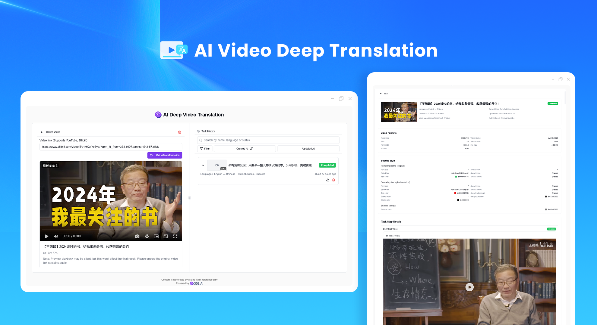
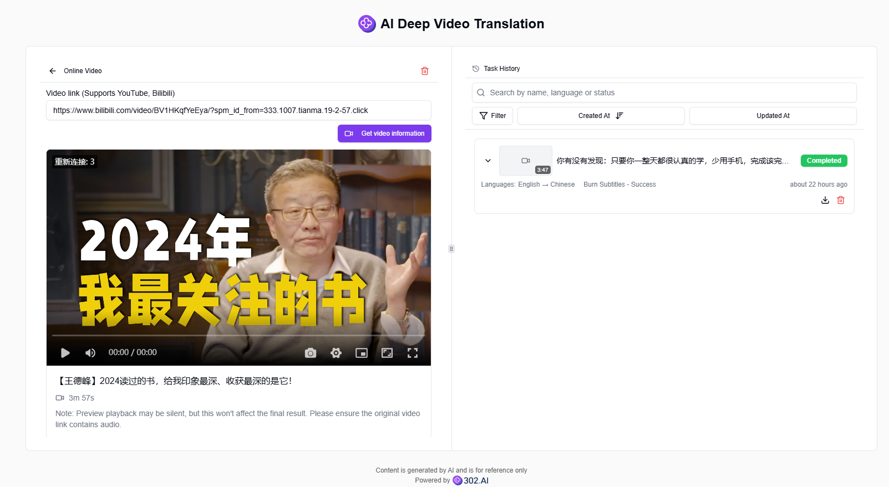
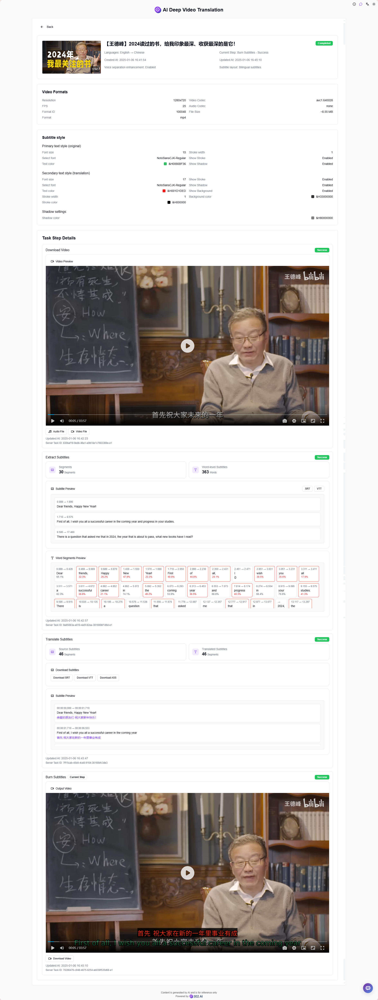
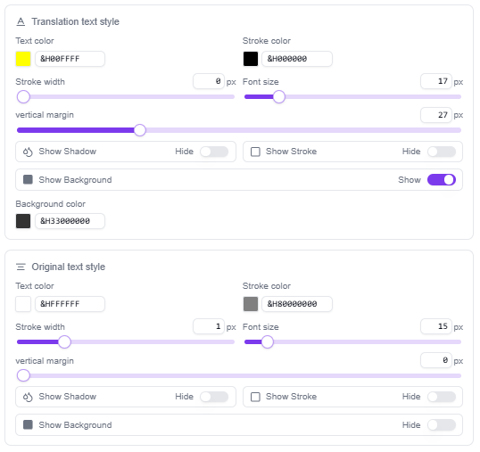

# 
🎥 AI Deep Video Translation 🚀✨

AI Deep Video Translation is a powerful tool focused on fully automated localization of video content, capable of automatically downloading and processing multi-source video content, achieving accurate speech recognition and transcription through advanced AI models, supporting high-quality multi-language translation to ensure accurate semantic delivery, providing subtitle style customization features, and implementing intelligent subtitle burning.

<a href="README_zh.md">中文</a> | <a href="README.md">English</a> | <a href="README_ja.md">日本語</a>

Open-source version of the [AI Deep Video Translation tool](https://302.ai/tools/dubbing/) from [302.AI](https://302.ai).
You can directly log in to 302.AI for a zero-code, zero-configuration online experience.
Alternatively, customize this project to suit your needs, integrate 302.AI's API KEY, and deploy it yourself.

## Interface Preview
Supports various video sources and formats, allowing easy upload or input of video URLs for processing.

Powerful video processing features, including video download, audio extraction, text transcription, subtitle translation, etc.

Flexible subtitle style settings, allowing customization of font, color, size, etc.

## Project Features
### 🎯 Multi-source Video Support
  Supports various video sources and formats, including local uploads and URL inputs.
### 📝 Efficient Video Processing
- Automatic video download and audio extraction.
- Accurate speech recognition and text transcription.
### 🌐 Multi-language Translation
  Supports high-quality subtitle translation between multiple languages.
### ✏️ Subtitle Editing and Styling
- Flexible subtitle editing function, supporting real-time modifications and adjustments.
- Rich subtitle style setting options.
### 🖥️ Real-time Preview
  Real-time preview of effects during processing to ensure output quality.
### 📊 Task Management System
  Complete task creation, pause, resume, and cancel functions.
### 💾 Local Data Storage
  Efficient local data management using Dexie.js.
### 🌓 Dark Mode
  Supports dark mode to protect your eyes.
### 🌍 Multi-language Interface
  - 中文界面
  - English Interface
  - 日本語インターフェース

With AI Deep Video Translation, easily achieve professional-level video localization! 🎉🎥 Let's explore the new world of AI-driven video translation together! 🌟🚀

## 🚩 Future Update Plans
- [ ] Support for more video sources and formats
- [ ] Support for user subtitle editing
- [ ] Optimize translation quality and efficiency
- [ ] Add more subtitle style options

## Tech Stack
- Next.js 14
- TypeScript
- TailwindCSS
- Radix UI & shadcn/ui
- Jotai
- React Hook Form
- SWR
- Dexie.js
- Framer Motion
- artplayer

## Development & Deployment
1. Clone the project `git clone https://github.com/302ai/302_ai_deep_video_translation.git`
2. Install dependencies `pnpm install`
3. Configure environment variables: Copy `.env.example` to `.env.local` and modify
4. Run the project `pnpm dev`
5. Build for production `pnpm build && pnpm start`

## ✨ About 302.AI ✨
[302.AI](https://302.ai) is an enterprise-oriented AI application platform that offers pay-as-you-go services, ready-to-use solutions, and an open-source ecosystem.✨
1. 🧠 Comprehensive AI capabilities: Incorporates the latest in language, image, audio, and video models from leading AI brands.
2. 🚀 Advanced application development: We build genuine AI products, not just simple chatbots.
3. 💰 No monthly fees: All features are pay-per-use, fully accessible, ensuring low entry barriers with high potential.
4. 🛠 Powerful admin dashboard: Designed for teams and SMEs - managed by one, used by many.
5. 🔗 API access for all AI features: All tools are open-source and customizable (in progress).
6. 💡 Powerful development team: Launching 2-3 new applications weekly with daily product updates. Interested developers are welcome to contact us.
