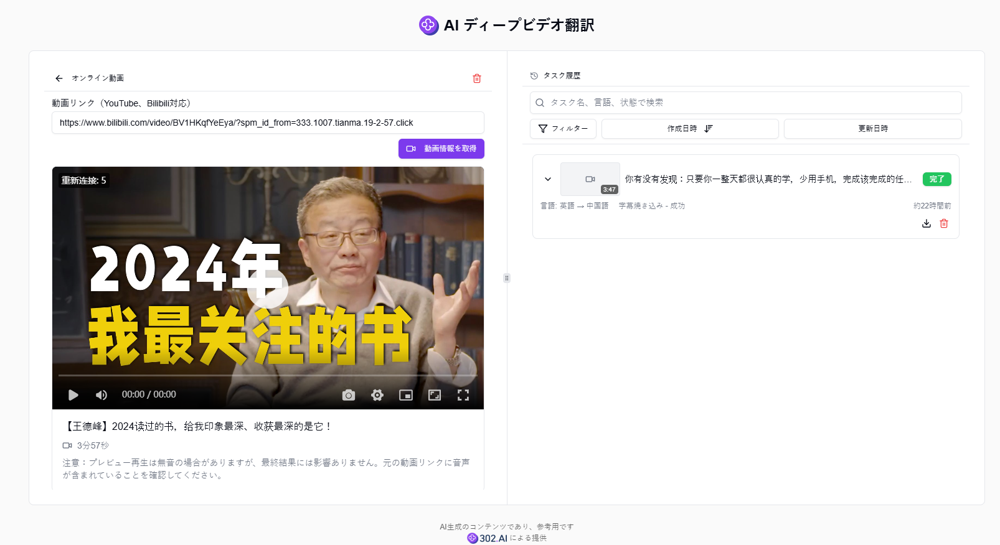

# 
🎥 AIビデオ深層翻訳 🚀✨

AIビデオ深層翻訳は、ビデオコンテンツの完全自動ローカライゼーション処理に特化した強力なツールです。マルチソースビデオコンテンツの自動ダウンロードと処理が可能で、先進的なAIモデルによる正確な音声認識と転写を実現し、意味を正確に伝える高品質な多言語翻訳をサポートし、字幕スタイルのカスタマイズ機能を提供し、インテリジェントな字幕の焼き付けを実現します。

<a href="README_zh.md">中文</a> | <a href="README.md">English</a> | <a href="README_ja.md">日本語</a>

これは[302.AI](https://302.ai)の[AIビデオ深層翻訳](https://302.ai/tools/dubbing/)のオープンソース版です。
302.AIに直接ログインすることで、コード不要、設定不要のオンライン体験が可能です。
あるいは、このプロジェクトをニーズに合わせてカスタマイズし、302.AIのAPI KEYを統合して、自身でデプロイすることもできます。

## インターフェースプレビュー
様々なビデオソースとフォーマットをサポートし、簡単にアップロードまたはビデオURLを入力して処理できます。

ビデオのダウンロード、音声抽出、テキスト転写、字幕翻訳など、強力なビデオ処理機能を提供します。

柔軟な字幕スタイル設定、フォント、色、サイズなどをカスタマイズできます。

## プロジェクトの特徴
### 🎯 マルチソースビデオサポート
  ローカルアップロードやURL入力を含む、様々なビデオソースとフォーマットをサポートします。
### 📝 効率的なビデオ処理
- 自動ビデオダウンロードと音声抽出。
- 正確な音声認識とテキスト転写。
### 🌐 多言語翻訳
  複数の言語間の高品質な字幕翻訳をサポートします。
### ✏️ 字幕編集とスタイリング
- 柔軟な字幕編集機能、リアルタイムの修正と調整をサポート。
- 豊富な字幕スタイル設定オプション。
### 🖥️ リアルタイムプレビュー
  処理中のエフェクトをリアルタイムでプレビューし、出力品質を確保します。
### 📊 タスク管理システム
  完全なタスクの作成、一時停止、再開、キャンセル機能。
### 💾 ローカルデータストレージ
  Dexie.jsを使用した効率的なローカルデータ管理。
### 🌓 ダークモード
  目を保護するダークモードをサポートします。
### 🌍 多言語インターフェース
  - 中文界面
  - English Interface
  - 日本語インターフェース

AIビデオ深層翻訳で、プロフェッショナルレベルのビデオローカライゼーションを簡単に実現！ 🎉🎥 AIドリブンのビデオ翻訳の新世界を一緒に探索しましょう！ 🌟🚀

## 🚩 今後の更新計画
- [ ] より多くのビデオソースとフォーマットのサポート
- [ ] ユーザーによる字幕編集のサポート
- [ ] 翻訳品質と効率の最適化
- [ ] より多くの字幕スタイルオプションの追加

## 技術スタック
- Next.js 14
- TypeScript
- TailwindCSS
- Radix UI & shadcn/ui
- Jotai
- React Hook Form
- SWR
- Dexie.js
- Framer Motion
- artplayer

## 開発とデプロイ
1. プロジェクトをクローン `git clone https://github.com/302ai/302_ai_deep_video_translation.git`
2. 依存関係をインストール `pnpm install`
3. 環境変数を設定：`.env.example`を`.env.local`にコピーして修正
4. プロジェクトを実行 `pnpm dev`
5. プロダクションビルド `pnpm build && pnpm start`

## ✨ 302.AIについて ✨
[302.AI](https://302.ai)は企業向けのAIアプリケーションプラットフォームであり、必要に応じて支払い、すぐに使用できるオープンソースのエコシステムです。✨
1. 🧠 包括的なAI機能：主要AIブランドの最新の言語、画像、音声、ビデオモデルを統合。
2. 🚀 高度なアプリケーション開発：単なるシンプルなチャットボットではなく、本格的なAI製品を構築。
3. 💰 月額料金なし：すべての機能が従量制で、完全にアクセス可能。低い参入障壁と高い可能性を確保。
4. 🛠 強力な管理ダッシュボード：チームやSME向けに設計 - 一人で管理し、多くの人が使用可能。
5. 🔗 すべてのAI機能へのAPIアクセス：すべてのツールはオープンソースでカスタマイズ可能（進行中）。
6. 💪 強力な開発チーム：大規模で高度なスキルを持つ開発者集団。毎週2-3の新しいアプリケーションをリリースし、毎日製品更新を行っています。才能ある開発者の参加を歓迎します。
