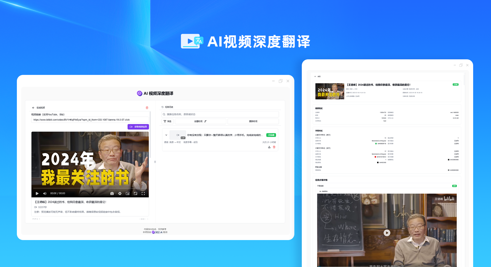
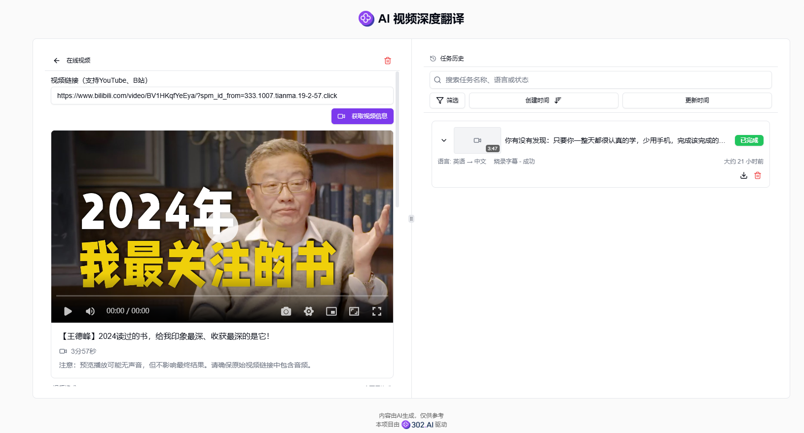
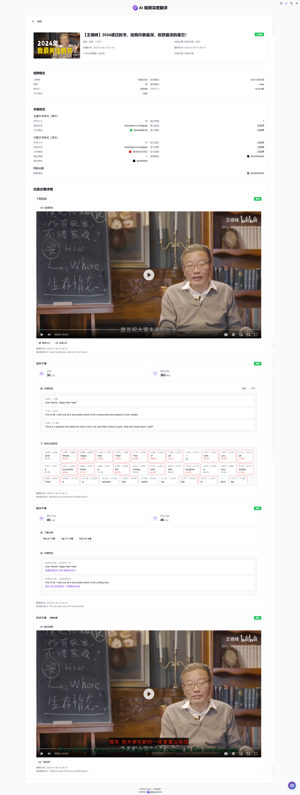
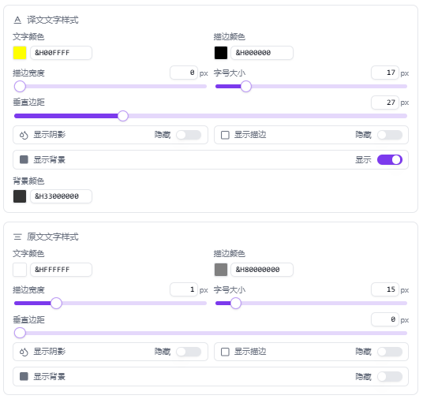

# 
🎥 AI视频深度翻译 🚀✨

AI视频深度翻译是一款功能强大的工具，专注于视频内容的全自动本地化处理，它能够自动下载和处理多源视频内容，通过先进的AI模型实现精准的语音识别和转录，支持多语言高质量翻译以确保语义准确传达，提供字幕样式定制功能，并实现字幕的智能烧录。

<a href="README_zh.md">中文</a> | <a href="README.md">English</a> | <a href="README_ja.md">日本語</a>

来自[302.AI](https://302.ai)的[AI深度视频翻译工具](https://302.ai/tools/dubbing/)的开源版本。
你可以直接登录302.AI，零代码零配置使用在线版本。
或者对本项目根据自己的需求进行修改，传入302.AI的API KEY，自行部署。

## 界面预览
支持多种视频源和格式，可以轻松上传或输入视频URL进行处理。

强大的视频处理功能，包括视频下载、音频提取、文本转录、字幕翻译等。

灵活的字幕样式设置，可以自定义字体、颜色、大小等。

## 项目特性
### 🎯 多源视频支持
  支持多种视频源和格式，包括本地上传和URL输入。
### 📝 高效视频处理
- 自动视频下载和音频提取。
- 精准的语音识别和文本转录。
### 🌐 多语言翻译
  支持多种语言之间的高质量字幕翻译。
### ✏️ 字幕编辑与样式
- 灵活的字幕编辑功能，支持实时修改和调整。
- 丰富的字幕样式设置选项。
### 🖥️ 实时预览
  处理过程中实时预览效果，确保输出质量。
### 📊 任务管理系统
  完整的任务创建、暂停、恢复和取消功能。
### 💾 本地数据存储
  使用 Dexie.js 进行高效的本地数据管理。
### 🌓 暗色模式
  支持暗色模式，保护您的眼睛。
### 🌍 多语言界面
  - 中文界面
  - English Interface
  - 日本語インターフェース

通过AI视频深度翻译，轻松实现专业级的视频本地化! 🎉🎥 让我们一起探索AI驱动的视频翻译新世界吧! 🌟🚀

## 🚩 未来更新计划
- [ ] 支持更多视频源和格式
- [ ] 支持用户编辑字幕
- [ ] 优化翻译质量和效率
- [ ] 增加更多字幕样式选项

## 技术栈
- Next.js 14
- TypeScript
- TailwindCSS
- Radix UI & shadcn/ui
- Jotai
- React Hook Form
- SWR
- Dexie.js
- Framer Motion
- artplayer

## 开发&部署
1. 克隆项目 `git clone https://github.com/302ai/302_ai_deep_video_translation.git`
2. 安装依赖 `pnpm install`
3. 配置环境变量 复制 `.env.example` 到 `.env.local` 并修改
4. 运行项目 `pnpm dev`
5. 构建生产版本 `pnpm build && pnpm start`

## ✨ 302.AI介绍 ✨
[302.AI](https://302.ai)是一个面向企业的AI应用平台，按需付费，开箱即用，开源生态。✨
1. 🧠 集合了最新最全的AI能力和品牌，包括但不限于语言模型、图像模型、声音模型、视频模型。
2. 🚀 在基础模型上进行深度应用开发，我们开发真正的AI产品，而不是简单的对话机器人
3. 💰 零月费，所有功能按需付费，全面开放，做到真正的门槛低，上限高。
4. 🛠  功能强大的管理后台，面向团队和中小企业，一人管理，多人使用。
5. 🔗 所有AI能力均提供API接入，所有工具开源可自行定制（进行中）。
6. 💡 强大的开发团队，每周推出2-3个新应用，产品每日更新。有兴趣加入的开发者也欢迎联系我们
